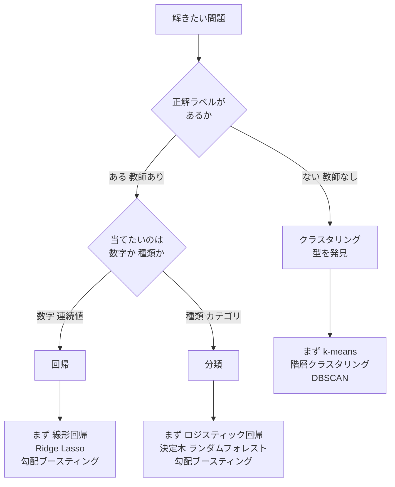

# 古典ML 選定マップ（M3 出荷物）

> 2026-06-25 / Hiro's Master Program M3 Week9。
> 問題を見て「回帰 / 分類 / クラスタリング」のどれを選ぶかを即判断するためのリファレンス。
> 実装(scikit-learn)は AI に任せ、**どれを選ぶかの判断**を自分で握るための地図。

## 決定フローチャート

## 3つの箱と手法

### 回帰（数字を当てる）
| 手法 | いつ |
|---|---|
| **線形回帰** | まず最初（baseline）。直線で関係を引く |
| Ridge / Lasso | 特徴量が多い。Lasso は効かない変数を自動で消す |
| **勾配ブースティング**（XGBoost / LightGBM） | 表データで本気（M3 W10 で本格） |

### 分類（種類を当てる）
| 手法 | いつ |
|---|---|
| **ロジスティック回帰** | まず最初（baseline）。※名前は回帰だが分類 |
| 決定木 / ランダムフォレスト | 関係が複雑・解釈したい |
| **勾配ブースティング** | 表データで本気。回帰と同じ手法が使える |

### クラスタリング（型を発見）
| 手法 | いつ |
|---|---|
| **k-means** | まず最初。k 個に分ける |
| 階層クラスタリング | 数を決めず樹形図で見る |
| DBSCAN | 外れ値・変な形に強い |

## 判断ルール3つ
1. **必ず baseline から**（線形回帰 / ロジスティック回帰 / k-means）。いきなり複雑なモデルは素人
2. **表データなら 木系 → 勾配ブースティング が鉄板**（回帰でも分類でも）
3. **ロジスティック「回帰」は分類**。名前に騙されない

## 分類 vs クラスタリングの本質
- **分類** = 人間が決めた型を**再現**（ラベルが先にある）
- **クラスタリング** = データから型を**発見**（人間が思いつかない型が出ることもある）
- 構造を「押し付ける」か「発見する」か、の違い。
